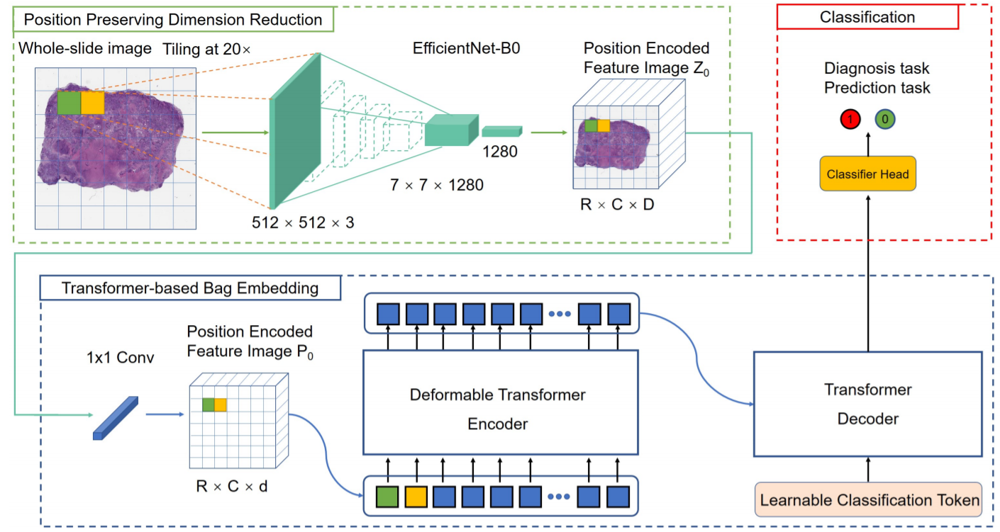

# DT-MIL

This repository is an official PyTorch implementation of the paper 
**"DT-MIL: Deformable Transformer for Multi-instance Learning on Histopathological Image"** [paper]() 
from **MICCAI 2021**.



## Citation


## Installation
### Dependencies
* Python 3.6
* PyTorch >= 1.5.0
* einops
* numpy
* scipy
* sklearn
* openslide
* albumentations
* opencv
* efficientnet_pytorch
* yacs


### Compiling
```shell script
cd ./models/ops
bash ./make.sh
# unit test (should see all checking is True)
python3 test.py
```

## Usage

### Inference


```shell script
EXP_DIR=<path/to/result/save/dir>

python3 -u main.py \
    --output_dir data \
    --num_input_channels 1280 \
    --num_class 2 \
    --batch_size 1 \
    --num_workers 1 \
    --num_queries 2 \
    --frozen_weights ./checkpoints/checkpoint_best.pth
```

### Note for data

You can refer the code in `script/extract_feature.py` and `script/merge_patch_feat.py` to process your own data.

We also include sample data downloaded from [TCIA CPTAC Pathology Portal](https://cancerimagingarchive.net/datascope/cptac/home/) for testing, which are stored in the `./data` folder.


## Disclaimer

This tool is for research purpose and not approved for clinical use.

This is not an official Tencent product.